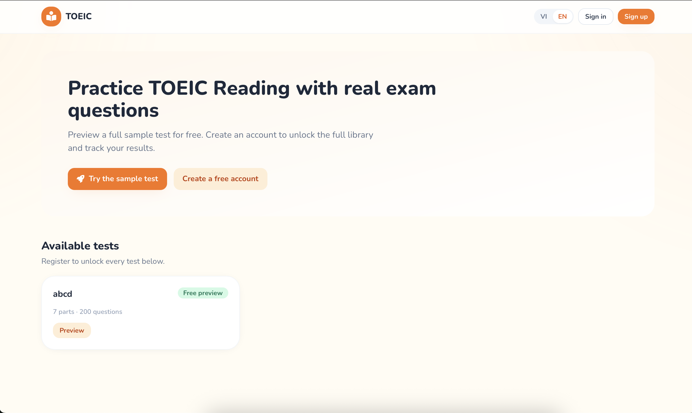
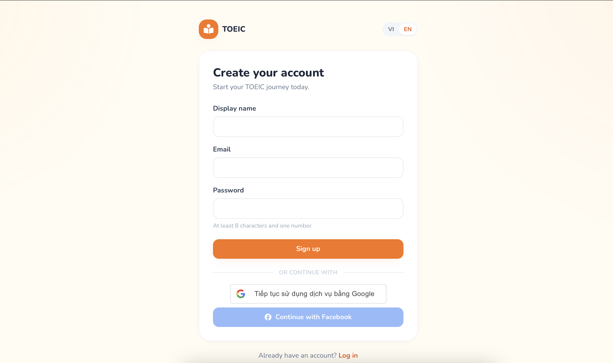
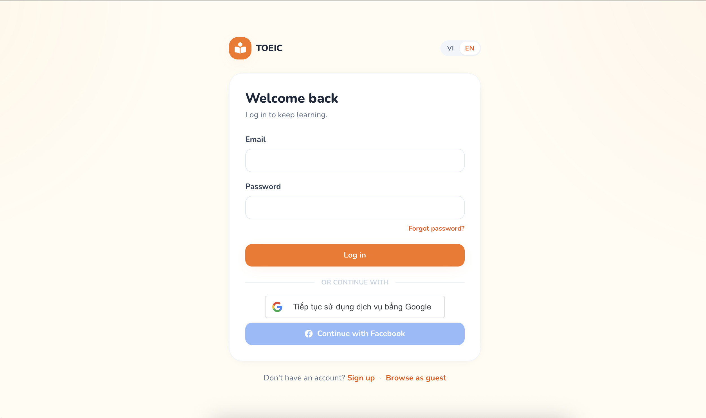
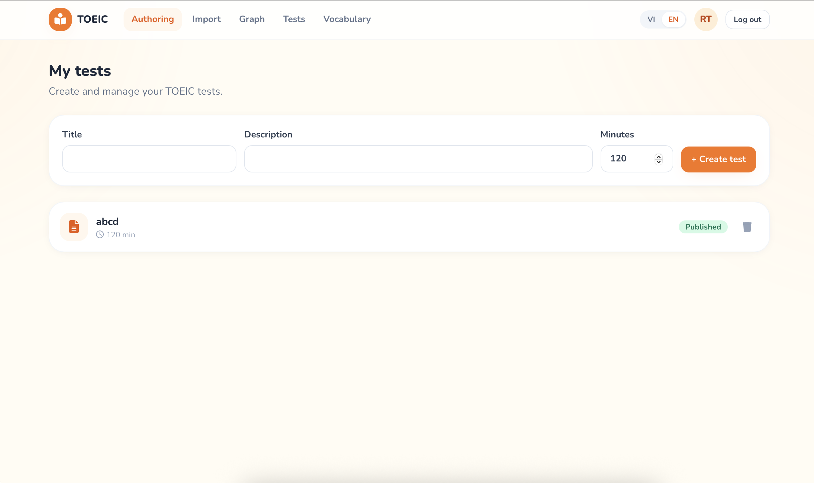
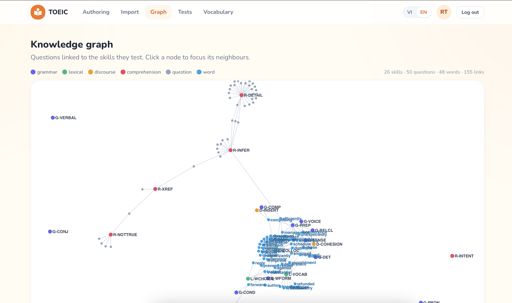
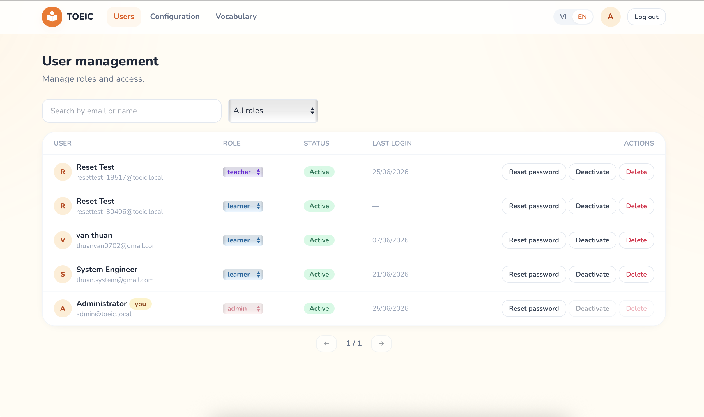

# TOEIC App — System Overview

A web platform for practising **TOEIC Reading** with real exam questions. Teachers
import question sets from PDFs, the system extracts and tags them into a
**knowledge graph** of skills, and learners practise — with an integrated
**English Learning Knowledge Graph** that turns words and answers into vocabulary
study material.

This document gives a visual, role-by-role tour. (Screenshots live in
[`images/`](./images).)

---

## Architecture at a glance

| Layer | Technology | Responsibility |
|---|---|---|
| **Frontend** | React + Vite + Tailwind | UI for guests, learners, teachers, admins (EN/VI) |
| **Backend API** | NestJS + TypeORM | Auth, tests, attempts, scoring, knowledge graph, vocabulary |
| **Extraction service** | Python (OCR + LLM) | Turns uploaded PDFs/DOCX into structured questions |
| **Database** | PostgreSQL | System of record (users, tests, questions, skills, lexical graph) |
| **Queue / cache** | Redis | Extraction job queue between API and worker |
| **LLM** | Ollama (pluggable: Claude / OpenAI) | Question extraction, skill tagging, vocabulary generation |

```
Browser ──> Frontend (nginx) ──/api──> NestJS API ──> PostgreSQL
                                          │  └── Redis ──> Python Extraction Worker ──> LLM (Ollama)
                                          └── LLM (Ollama)  // synchronous vocab generation
```

---

## 1. Public landing (guest)

Guests can browse the catalogue and try a free sample test before signing up.
Language can be switched between **Vietnamese and English** at any time.



---

## 2. Sign up & sign in

Email/password registration (with a password policy), plus **Google** and
**Facebook** social login. Visitors can also continue as a **guest**.

| Create an account | Log in |
|---|---|
|  |  |

---

## 3. Roles

The app is **role-based** — the navigation and capabilities change per role:

| Role | Navigation | Can do |
|---|---|---|
| **Guest** | — | Browse catalogue, try the sample test |
| **Learner** | Tests · Practice · Vocabulary · Results | Take tests, practise weak skills, look up vocabulary, see results |
| **Teacher** | Authoring · Import · Graph · Tests · Vocabulary | Author/import tests, build the knowledge graph, manage questions |
| **Admin** | Users · Configuration · Vocabulary | Manage users/roles, configure the system |

---

## 4. Teacher — authoring & import

Teachers create TOEIC tests, or **import questions from a PDF/DOCX**: the Python
service OCRs the document, an LLM extracts the questions and answers, and they
land in a review screen (editable + savable) before being published into a test.



---

## 5. Knowledge graph

The heart of the platform. Every question is tagged with the **skills** it tests
(grammar, lexical, discourse, comprehension), forming a graph of
`Question ↔ Skill ↔ Learner`. The **lexical layer** adds **word** nodes (from the
Vocabulary feature and from extracted answers), linked to the skills their
exercises test.

- Click a **skill/question** node to focus its neighbourhood.
- Hover a **word** node to see its example sentences; click it to open the word's
  sentence list.



---

## 6. Vocabulary — English Learning Knowledge Graph

Available to every signed-in user. Enter an English word and the system generates
useful learning content — **meaning, pattern, example sentences, and a fill-in
exercise** — caching it into the graph so it grows over time:

```
Input: improve
  Meaning : to make something better
  Pattern : improve + noun
  Sentence: I want to improve my English.
  Exercise: I want to ______ my English.
```

Answering an exercise is graded server-side and feeds the same **skill-mastery**
model as TOEIC questions, so vocabulary practice and test practice reinforce one
another.

---

## 7. Admin — user management

Admins manage accounts: search users, change **roles** (learner / teacher /
admin), activate/deactivate, reset passwords, and configure the system.



---

## End-to-end flow

```
Teacher uploads PDF ──> OCR + LLM extraction ──> review & edit staged questions
        └──> publish into a Test ──> questions tagged with Skills (knowledge graph)
                                          │
Learner takes test / practises ──> answers graded ──> per-skill mastery updated
        └──> weak-skill recommendations + Vocabulary practice (word ↔ skill ↔ learner)
```

---

_Screenshots: [`images/`](./images). For deeper design notes see
[`docs/adr-knowledge-graph.md`](./docs/adr-knowledge-graph.md) and
[`docs/adr-english-learning-kg.md`](./docs/adr-english-learning-kg.md)._
